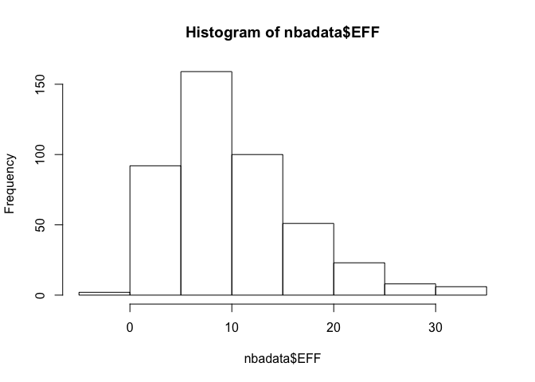
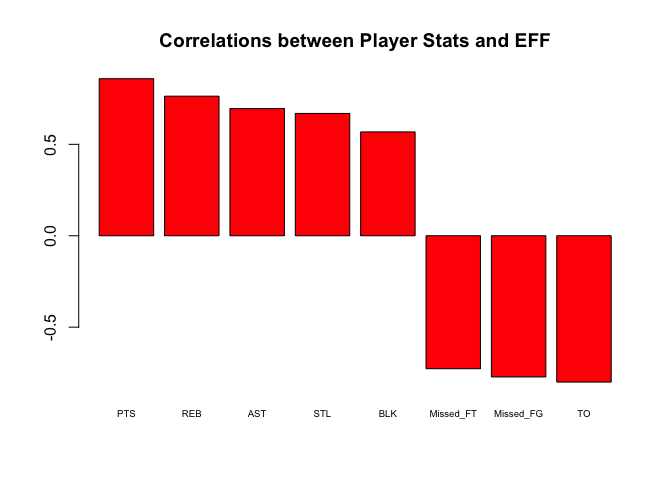
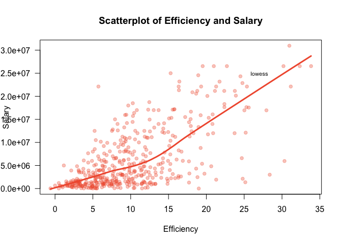
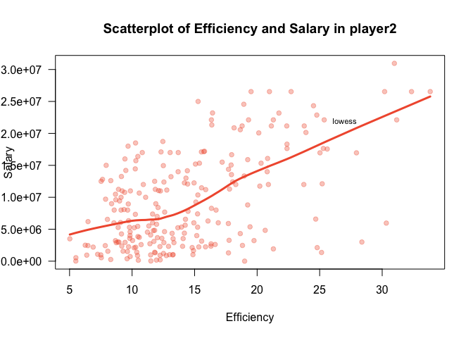

hw02
================
JIEUN HWANG
9/27/2017

2 Import the data in R
======================

``` r
library(readr)

# recall that read.csv() uses the argument colClasses to specify data type
nbadata <- read.csv('nba2017-player-statistics.csv',
                 header = TRUE, 
                 colClasses = c("character","character","factor","character","double","double","double","double","double","double","double","double","double", "double","double","double","double","double","double","double","double","double","double","double"))

str(nbadata, vec.len = 1)
```

    ## 'data.frame':    441 obs. of  24 variables:
    ##  $ Player      : chr  "Al Horford" ...
    ##  $ Team        : chr  "BOS" ...
    ##  $ Position    : Factor w/ 5 levels "C","PF","PG",..: 1 2 ...
    ##  $ Experience  : chr  "9" ...
    ##  $ Salary      : num  26540100 ...
    ##  $ Rank        : num  4 6 ...
    ##  $ Age         : num  30 29 ...
    ##  $ GP          : num  68 80 ...
    ##  $ GS          : num  68 77 ...
    ##  $ MIN         : num  2193 ...
    ##  $ FGM         : num  379 213 ...
    ##  $ FGA         : num  801 370 ...
    ##  $ Points3     : num  86 27 ...
    ##  $ Points3_atts: num  242 66 ...
    ##  $ Points2     : num  293 186 ...
    ##  $ Points2_atts: num  559 304 ...
    ##  $ FTM         : num  108 67 ...
    ##  $ FTA         : num  135 100 ...
    ##  $ OREB        : num  95 117 ...
    ##  $ DREB        : num  369 248 ...
    ##  $ AST         : num  337 140 ...
    ##  $ STL         : num  52 52 ...
    ##  $ BLK         : num  87 62 ...
    ##  $ TO          : num  116 77 ...

``` r
# recall that read_csv() uses the argument col_types to specify data type

nbadata <- read_csv("nba2017-player-statistics.csv", 
                 col_types = list(col_character(),col_character(),col_character(),col_character(),col_double(),col_double(),col_double(),col_double(),
                                  col_double(),col_double(),col_double(),col_double(),col_double(),col_double(),col_double(),col_double(),col_double(),
                                  col_double(),col_double(),col_double(),col_double(),col_double(),col_double(),col_double()))

nbadata$Position <- as.factor(nbadata$Position)

str(nbadata,vec.len = 1)
```

    ## Classes 'tbl_df', 'tbl' and 'data.frame':    441 obs. of  24 variables:
    ##  $ Player      : chr  "Al Horford" ...
    ##  $ Team        : chr  "BOS" ...
    ##  $ Position    : Factor w/ 5 levels "C","PF","PG",..: 1 2 ...
    ##  $ Experience  : chr  "9" ...
    ##  $ Salary      : num  26540100 ...
    ##  $ Rank        : num  4 6 ...
    ##  $ Age         : num  30 29 ...
    ##  $ GP          : num  68 80 ...
    ##  $ GS          : num  68 77 ...
    ##  $ MIN         : num  2193 ...
    ##  $ FGM         : num  379 213 ...
    ##  $ FGA         : num  801 370 ...
    ##  $ Points3     : num  86 27 ...
    ##  $ Points3_atts: num  242 66 ...
    ##  $ Points2     : num  293 186 ...
    ##  $ Points2_atts: num  559 304 ...
    ##  $ FTM         : num  108 67 ...
    ##  $ FTA         : num  135 100 ...
    ##  $ OREB        : num  95 117 ...
    ##  $ DREB        : num  369 248 ...
    ##  $ AST         : num  337 140 ...
    ##  $ STL         : num  52 52 ...
    ##  $ BLK         : num  87 62 ...
    ##  $ TO          : num  116 77 ...
    ##  - attr(*, "spec")=List of 2
    ##   ..$ cols   :List of 24
    ##   .. ..$ Player      : list()
    ##   .. .. ..- attr(*, "class")= chr  "collector_character" ...
    ##   .. ..$ Team        : list()
    ##   .. .. ..- attr(*, "class")= chr  "collector_character" ...
    ##   .. ..$ Position    : list()
    ##   .. .. ..- attr(*, "class")= chr  "collector_character" ...
    ##   .. ..$ Experience  : list()
    ##   .. .. ..- attr(*, "class")= chr  "collector_character" ...
    ##   .. ..$ Salary      : list()
    ##   .. .. ..- attr(*, "class")= chr  "collector_double" ...
    ##   .. ..$ Rank        : list()
    ##   .. .. ..- attr(*, "class")= chr  "collector_double" ...
    ##   .. ..$ Age         : list()
    ##   .. .. ..- attr(*, "class")= chr  "collector_double" ...
    ##   .. ..$ GP          : list()
    ##   .. .. ..- attr(*, "class")= chr  "collector_double" ...
    ##   .. ..$ GS          : list()
    ##   .. .. ..- attr(*, "class")= chr  "collector_double" ...
    ##   .. ..$ MIN         : list()
    ##   .. .. ..- attr(*, "class")= chr  "collector_double" ...
    ##   .. ..$ FGM         : list()
    ##   .. .. ..- attr(*, "class")= chr  "collector_double" ...
    ##   .. ..$ FGA         : list()
    ##   .. .. ..- attr(*, "class")= chr  "collector_double" ...
    ##   .. ..$ Points3     : list()
    ##   .. .. ..- attr(*, "class")= chr  "collector_double" ...
    ##   .. ..$ Points3_atts: list()
    ##   .. .. ..- attr(*, "class")= chr  "collector_double" ...
    ##   .. ..$ Points2     : list()
    ##   .. .. ..- attr(*, "class")= chr  "collector_double" ...
    ##   .. ..$ Points2_atts: list()
    ##   .. .. ..- attr(*, "class")= chr  "collector_double" ...
    ##   .. ..$ FTM         : list()
    ##   .. .. ..- attr(*, "class")= chr  "collector_double" ...
    ##   .. ..$ FTA         : list()
    ##   .. .. ..- attr(*, "class")= chr  "collector_double" ...
    ##   .. ..$ OREB        : list()
    ##   .. .. ..- attr(*, "class")= chr  "collector_double" ...
    ##   .. ..$ DREB        : list()
    ##   .. .. ..- attr(*, "class")= chr  "collector_double" ...
    ##   .. ..$ AST         : list()
    ##   .. .. ..- attr(*, "class")= chr  "collector_double" ...
    ##   .. ..$ STL         : list()
    ##   .. .. ..- attr(*, "class")= chr  "collector_double" ...
    ##   .. ..$ BLK         : list()
    ##   .. .. ..- attr(*, "class")= chr  "collector_double" ...
    ##   .. ..$ TO          : list()
    ##   .. .. ..- attr(*, "class")= chr  "collector_double" ...
    ##   ..$ default: list()
    ##   .. ..- attr(*, "class")= chr  "collector_guess" ...
    ##   ..- attr(*, "class")= chr "col_spec"

``` r
# the columns player, team and experience have to be declared as type character
library(dplyr)
```

    ## Warning: package 'dplyr' was built under R version 3.4.2

    ## 
    ## Attaching package: 'dplyr'

    ## The following objects are masked from 'package:stats':
    ## 
    ##     filter, lag

    ## The following objects are masked from 'package:base':
    ## 
    ##     intersect, setdiff, setequal, union

``` r
class(nbadata$Player)
```

    ## [1] "character"

``` r
nbadata$Team <-as.character(nbadata$Team)
nbadata$Experience <-as.character(nbadata$Experience)
class(nbadata$Team)
```

    ## [1] "character"

``` r
class(nbadata$Experience)
```

    ## [1] "character"

``` r
# the column Position has to be declared as a factor with levels 
nbadata$Position <- as.factor(nbadata$Position)
class(nbadata$Position)
```

    ## [1] "factor"

``` r
# the column salary has to be declared as type double
nbadata$Salary <-as.double(nbadata$Salary)
class(nbadata$Salary)
```

    ## [1] "numeric"

``` r
# the rest of the 19 columns have to be declared as type double
nbadata[,6:24] <- sapply(nbadata[,6:24], as.double)
nbadata
```

    ## # A tibble: 441 x 24
    ##               Player  Team Position Experience   Salary  Rank   Age    GP
    ##                <chr> <chr>   <fctr>      <chr>    <dbl> <dbl> <dbl> <dbl>
    ##  1        Al Horford   BOS        C          9 26540100     4    30    68
    ##  2      Amir Johnson   BOS       PF         11 12000000     6    29    80
    ##  3     Avery Bradley   BOS       SG          6  8269663     5    26    55
    ##  4 Demetrius Jackson   BOS       PG          R  1450000    15    22     5
    ##  5      Gerald Green   BOS       SF          9  1410598    11    31    47
    ##  6     Isaiah Thomas   BOS       PG          5  6587132     1    27    76
    ##  7       Jae Crowder   BOS       SF          4  6286408     3    26    72
    ##  8       James Young   BOS       SG          2  1825200    13    21    29
    ##  9      Jaylen Brown   BOS       SF          R  4743000     8    20    78
    ## 10     Jonas Jerebko   BOS       PF          6  5000000    10    29    78
    ## # ... with 431 more rows, and 16 more variables: GS <dbl>, MIN <dbl>,
    ## #   FGM <dbl>, FGA <dbl>, Points3 <dbl>, Points3_atts <dbl>,
    ## #   Points2 <dbl>, Points2_atts <dbl>, FTM <dbl>, FTA <dbl>, OREB <dbl>,
    ## #   DREB <dbl>, AST <dbl>, STL <dbl>, BLK <dbl>, TO <dbl>

3 Right after importing the data
================================

``` r
# Replace all the occurrences of "R" with 0, and then convert the entire column into integers
class(nbadata$Experience)
```

    ## [1] "character"

``` r
nbadata$Experience = replace(nbadata$Experience, nbadata$Experience=="R", 0)
nbadata$Experience
```

    ##   [1] "9"  "11" "6"  "0"  "9"  "5"  "4"  "2"  "0"  "6"  "1"  "3"  "2"  "1" 
    ##  [15] "4"  "10" "12" "11" "5"  "1"  "5"  "12" "13" "0"  "8"  "13" "5"  "13"
    ##  [29] "15" "5"  "2"  "5"  "1"  "7"  "7"  "0"  "0"  "4"  "10" "2"  "1"  "5" 
    ##  [43] "0"  "6"  "7"  "2"  "4"  "7"  "1"  "0"  "8"  "8"  "6"  "9"  "5"  "3" 
    ##  [57] "0"  "0"  "3"  "0"  "3"  "12" "8"  "11" "4"  "12" "0"  "14" "3"  "10"
    ##  [71] "3"  "10" "3"  "3"  "6"  "2"  "17" "4"  "4"  "0"  "3"  "8"  "4"  "1" 
    ##  [85] "9"  "0"  "3"  "8"  "12" "11" "0"  "7"  "1"  "6"  "6"  "5"  "11" "1" 
    ##  [99] "6"  "1"  "9"  "8"  "1"  "1"  "1"  "0"  "13" "3"  "1"  "5"  "2"  "3" 
    ## [113] "2"  "0"  "10" "8"  "4"  "8"  "4"  "7"  "9"  "1"  "1"  "6"  "0"  "0" 
    ## [127] "2"  "13" "7"  "1"  "4"  "4"  "12" "1"  "1"  "0"  "6"  "5"  "3"  "5" 
    ## [141] "0"  "3"  "5"  "1"  "5"  "4"  "1"  "1"  "3"  "1"  "4"  "2"  "5"  "9" 
    ## [155] "11" "4"  "4"  "8"  "9"  "0"  "13" "0"  "8"  "7"  "9"  "3"  "1"  "4" 
    ## [169] "5"  "0"  "0"  "0"  "0"  "9"  "0"  "2"  "5"  "9"  "8"  "2"  "2"  "4" 
    ## [183] "8"  "7"  "0"  "1"  "5"  "0"  "0"  "4"  "0"  "0"  "7"  "1"  "8"  "0" 
    ## [197] "1"  "2"  "1"  "3"  "4"  "0"  "1"  "6"  "0"  "4"  "3"  "8"  "0"  "0" 
    ## [211] "6"  "2"  "2"  "2"  "4"  "10" "1"  "2"  "2"  "6"  "12" "0"  "13" "4" 
    ## [225] "3"  "2"  "8"  "9"  "1"  "5"  "13" "0"  "11" "7"  "13" "0"  "7"  "11"
    ## [239] "0"  "0"  "3"  "9"  "1"  "5"  "2"  "10" "14" "7"  "15" "15" "2"  "0" 
    ## [253] "2"  "8"  "0"  "7"  "0"  "11" "1"  "4"  "8"  "1"  "12" "0"  "7"  "4" 
    ## [267] "6"  "11" "0"  "11" "8"  "0"  "10" "16" "8"  "8"  "18" "11" "6"  "5" 
    ## [281] "13" "1"  "6"  "8"  "6"  "3"  "2"  "15" "0"  "1"  "2"  "3"  "5"  "1" 
    ## [295] "0"  "3"  "0"  "2"  "5"  "2"  "1"  "4"  "12" "5"  "8"  "0"  "3"  "7" 
    ## [309] "3"  "0"  "8"  "5"  "0"  "2"  "2"  "1"  "8"  "9"  "12" "3"  "18" "0" 
    ## [323] "0"  "15" "6"  "3"  "3"  "4"  "6"  "6"  "0"  "2"  "4"  "4"  "2"  "1" 
    ## [337] "2"  "0"  "7"  "7"  "1"  "2"  "0"  "12" "0"  "5"  "0"  "3"  "16" "1" 
    ## [351] "8"  "4"  "8"  "6"  "4"  "1"  "0"  "7"  "6"  "4"  "5"  "4"  "7"  "6" 
    ## [365] "0"  "3"  "2"  "0"  "3"  "12" "18" "0"  "2"  "4"  "10" "0"  "2"  "0" 
    ## [379] "1"  "3"  "7"  "0"  "8"  "9"  "3"  "0"  "7"  "6"  "0"  "8"  "2"  "0" 
    ## [393] "10" "0"  "7"  "7"  "1"  "2"  "2"  "8"  "6"  "3"  "7"  "1"  "0"  "1" 
    ## [407] "7"  "5"  "3"  "1"  "2"  "0"  "9"  "1"  "0"  "0"  "2"  "2"  "1"  "12"
    ## [421] "16" "9"  "2"  "4"  "6"  "2"  "1"  "3"  "5"  "0"  "1"  "0"  "2"  "6" 
    ## [435] "9"  "13" "0"  "11" "2"  "0"  "15"

``` r
nbadata$Experience <- as.integer(nbadata$Experience) 
class(nbadata$Experience)
```

    ## [1] "integer"

4 Performance of player
=======================

``` r
sum <- nbadata$Points3*3 + nbadata$Points2*2 + nbadata$FTM

nbadata<-mutate(nbadata,
       Missed_FG = FGA - FGM, 
       Missed_FT = FTA - FTM, 
       PTS = sum, 
       REB = OREB+ DREB, 
       MPG = MIN/GP
)
 
nbadata <- mutate (nbadata,EFF = (PTS + REB + AST + STL + BLK - Missed_FG - Missed_FT - TO)/ GP)

summary(nbadata$EFF)
```

    ##    Min. 1st Qu.  Median    Mean 3rd Qu.    Max. 
    ##  -0.600   5.452   9.090  10.137  13.247  33.840

``` r
hist(nbadata$EFF)
```



``` r
# Display the player name, team, salary, and EFF value of the top-10 players by EFF in decreasing order (display this information in a data frame).

 nbadata%>% 
  arrange(desc(EFF)) %>%
  select(Player, Team, Salary,EFF) %>%
  slice(1:10)
```

    ## # A tibble: 10 x 4
    ##                   Player  Team   Salary      EFF
    ##                    <chr> <chr>    <dbl>    <dbl>
    ##  1     Russell Westbrook   OKC 26540100 33.83951
    ##  2          James Harden   HOU 26540100 32.34568
    ##  3         Anthony Davis   NOP 22116750 31.16000
    ##  4          LeBron James   CLE 30963450 30.97297
    ##  5    Karl-Anthony Towns   MIN  5960160 30.32927
    ##  6          Kevin Durant   GSW 26540100 30.19355
    ##  7 Giannis Antetokounmpo   MIL  2995421 28.37500
    ##  8      DeMarcus Cousins   NOP 16957900 27.94118
    ##  9          Jimmy Butler   CHI 17552209 25.60526
    ## 10      Hassan Whiteside   MIA 22116750 25.36364

``` r
# Provide the names of the players that have a negative EFF.

 nbadata %>%
   filter(EFF < 0) %>%
    select (EFF, Player)
```

    ## # A tibble: 1 x 2
    ##     EFF          Player
    ##   <dbl>           <chr>
    ## 1  -0.6 Patricio Garino

``` r
# Use the function cor() to compute the correlation coefficients between EFF and all the variables used in the EFF formula.

cor(nbadata$EFF,nbadata$PTS)
```

    ## [1] 0.8588644

``` r
cor(nbadata$EFF,nbadata$REB)
```

    ## [1] 0.7634501

``` r
cor(nbadata$EFF,nbadata$AST)
```

    ## [1] 0.6689232

``` r
cor(nbadata$EFF,nbadata$STL)
```

    ## [1] 0.6957286

``` r
cor(nbadata$EFF,nbadata$BLK)
```

    ## [1] 0.5679571

``` r
cor(nbadata$EFF,nbadata$Missed_FG)
```

    ## [1] 0.7722477

``` r
cor(nbadata$EFF,nbadata$Missed_FT)
```

    ## [1] 0.7271456

``` r
cor(nbadata$EFF,nbadata$TO)
```

    ## [1] 0.8003289

``` r
cor(nbadata$EFF,nbadata$GP)
```

    ## [1] 0.4773648

``` r
# Notice that Missed_FG, Missed_FT, and TO contribute negatively to EFF, so make sure to take into account this negative association when calculating the correlation coefficients.

-cor(nbadata$EFF,nbadata$Missed_FG)
```

    ## [1] -0.7722477

``` r
-cor(nbadata$EFF,nbadata$Missed_FT)
```

    ## [1] -0.7271456

``` r
-cor(nbadata$EFF,nbadata$TO)
```

    ## [1] -0.8003289

``` r
# Display the computed correlations in descending order, either in a vector or a data frame. And create a barchart with the correlations (bars in decreasing order) like the one below.

corr <- c(cor(nbadata$EFF,nbadata$PTS),
cor(nbadata$EFF,nbadata$REB),
cor(nbadata$EFF,nbadata$AST),
cor(nbadata$EFF,nbadata$STL),
cor(nbadata$EFF,nbadata$BLK),
-cor(nbadata$EFF,nbadata$Missed_FG),
-cor(nbadata$EFF,nbadata$Missed_FT),
-cor(nbadata$EFF,nbadata$TO))

corr <- corr[order(corr, decreasing = TRUE)]

barplot(corr, main = "Correlations between Player Stats and EFF", names.arg = c("PTS","REB","AST","STL","BLK","Missed_FT","Missed_FG","TO"),col="red",cex.names = 0.6)
```



5 Efficiency and Salary
=======================

``` r
# scatterplot between Efficiency and Salary
plot(nbadata$EFF, nbadata$Salary, las = 1,pch = 19, cex = 0.9, col = "#F15C3C55",xlab = "Efficiency", ylab = "Salary",main = "Scatterplot of Efficiency and Salary")

# lowess line
lines(lowess(nbadata$EFF,nbadata$Salary), lwd = 3, col = "#F15C3C")
text(27, 2.5e+07, labels = "lowess", col = "black", cex = 0.7)
```



``` r
# linear correlation 
cor(nbadata$EFF,nbadata$Salary)
```

    ## [1] 0.655624

``` r
# the more efficiency, the more salary
```

``` r
# Taking into account the column MPG (minutes per game) select those players that have an MPG value of 20 or more minutes per game
  nbadata%>%
   filter(MPG > 20) %>%
    select(MPG, Player)
```

    ## # A tibble: 231 x 2
    ##         MPG         Player
    ##       <dbl>          <chr>
    ##  1 32.25000     Al Horford
    ##  2 20.10000   Amir Johnson
    ##  3 33.36364  Avery Bradley
    ##  4 33.80263  Isaiah Thomas
    ##  5 32.43056    Jae Crowder
    ##  6 20.50667   Kelly Olynyk
    ##  7 30.36709   Marcus Smart
    ##  8 20.25000 Deron Williams
    ##  9 24.00000    Edy Tavares
    ## 10 25.48684  Iman Shumpert
    ## # ... with 221 more rows

``` r
# Create a data frame players2 with these players.
    player2 <- nbadata %>% filter(MPG > 20) %>% select(MPG, Player,EFF,Salary)
    player2
```

    ## # A tibble: 231 x 4
    ##         MPG         Player       EFF   Salary
    ##       <dbl>          <chr>     <dbl>    <dbl>
    ##  1 32.25000     Al Horford 19.514706 26540100
    ##  2 20.10000   Amir Johnson 10.900000 12000000
    ##  3 33.36364  Avery Bradley 16.345455  8269663
    ##  4 33.80263  Isaiah Thomas 24.684211  6587132
    ##  5 32.43056    Jae Crowder 16.069444  6286408
    ##  6 20.50667   Kelly Olynyk 11.746667  3094014
    ##  7 30.36709   Marcus Smart 12.379747  3578880
    ##  8 20.25000 Deron Williams  8.291667   259626
    ##  9 24.00000    Edy Tavares 19.000000     5145
    ## 10 25.48684  Iman Shumpert  7.881579  9700000
    ## # ... with 221 more rows

``` r
# Use this data frame to create a scatterplot between Efficiency and Salary, including a lowess smooth line.
    plot(player2$EFF, player2$Salary, las = 1,pch = 19, cex = 0.9, col = "#F15C3C55",xlab = "Efficiency", ylab = "Salary",main = "Scatterplot of Efficiency and Salary in player2")
    lines(lowess(player2$EFF,player2$Salary), lwd = 3, col = "#F15C3C")
    text(27, 2.2e+07, labels = "lowess", col = "black", cex = 0.7)
```



``` r
# Compute the linear correlation coefficient between these variables.
   cor(player2$EFF, player2$Salary)
```

    ## [1] 0.5367224

``` r
# What can you say about the relationship between these two variables for the set of more established players”?
  # compared to  correlation (EFF,salary) for all player, playerS who have MPG > 20, correlation is smaller. less stronger relationship  
```

6 Comments and Reflections
==========================

-   homework2 was harder than homework1. I spent time more one day. Making boxplot, lowess line was okay but I had hard time dealing with data frame. Also I had a lot of compile error read\_csv and read.csv().
