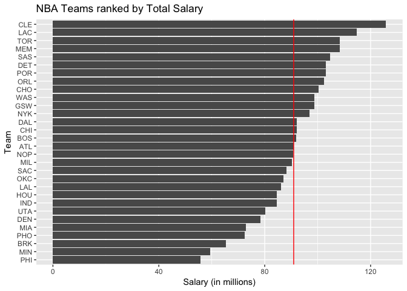
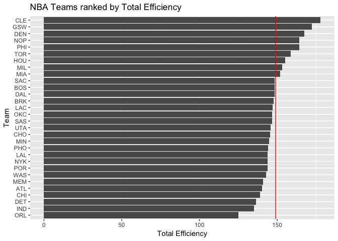
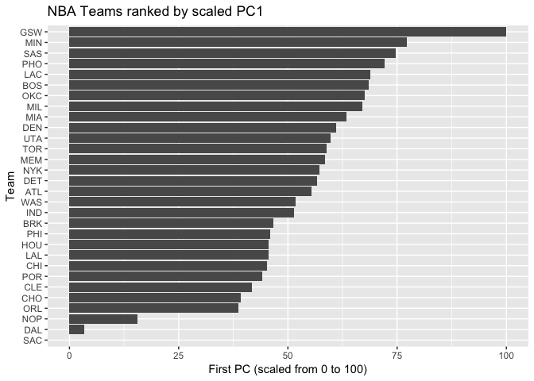

hw03-Jieun-Hwang.Rmd
================
JIEUN HWANG
10/10/2017

Basic Ranking
=============

NBA Teams ranked by Total Salary
--------------------------------

``` r
team_salary <- teams %>% select(team,salary) %>% arrange(salary)
team_salary_n <- 1:nrow(teams)

ggplot(team_salary , aes(x=reorder(team,team_salary_n), y=salary)) +
  geom_bar(stat='identity')+
  coord_flip()+
  xlab('Team')+
  ylab('Salary (in millions)')+
  ggtitle("NBA Teams ranked by Total Salary")+
  geom_hline(aes(yintercept=mean(salary)), color = "red")
```



NBA Teams ranked by Total Points
--------------------------------

``` r
team_points <- teams %>% select(team,points) %>% arrange(points)
team_points_n <- 1:nrow(teams)

ggplot(team_points , aes(x=reorder(team,team_points_n), y=points)) +
  geom_bar(stat='identity')+
  coord_flip()+
  xlab('Team')+
  ylab('Total Points')+
  ggtitle("NBA Teams ranked by Total Points")+
  geom_hline(aes(yintercept=mean(points)), color = "red")
```


NBA Teams ranked by Total Efficiency
------------------------------------

``` r
team_efficiency <- teams %>% select(team,efficiency) %>% arrange(efficiency)
team_efficiency_n <- 1:nrow(teams)

ggplot(team_efficiency, aes(x=reorder(team,team_efficiency_n), y=efficiency)) +
  geom_bar(stat='identity')+
  coord_flip()+
  xlab('Team')+
  ylab('Total Efficiency')+
  ggtitle("NBA Teams ranked by Total Efficiency")+
  geom_hline(aes(yintercept=mean(efficiency)), color = "red")
```



descriptions of the obtained rankings
=====================================

1.  NBA Teams ranked by Total Salary: max(CLE), min(PHI)
2.  NBA Teams ranked by Total Points: max(GSW), min(SAC)
3.  NBA Teams ranked by Total Efficiency: max(CLE), min(ORL)

Principal Components Analysis (PCA)
-----------------------------------

``` r
 pca_dat <- data.frame(
          teams$points3,
          teams$points2,
          teams$free_throws,
          teams$off_rebounds,
          teams$def_rebounds,
          teams$assists,
          teams$steals,
          teams$blocks,
          teams$turnovers,
          teams$fouls)
  
 matrix_teams <- as.matrix(pca_dat)
 PCA <- prcomp(matrix_teams, scale. = TRUE)
```

Create a data frame with the eigenvalues
========================================

``` r
 eigs <- data.frame(
 eigenvalue = round(PCA$sdev^2,4),
 proportion = round( PCA$sdev^2/ sum(PCA$sdev^2),4),
 cumprop = cumsum(round(PCA$sdev^2/ sum(PCA$sdev^2),4))
 )
 
 eigs
```

    ##    eigenvalue proportion cumprop
    ## 1      4.6959     0.4696  0.4696
    ## 2      1.7020     0.1702  0.6398
    ## 3      0.9795     0.0980  0.7378
    ## 4      0.7717     0.0772  0.8150
    ## 5      0.5341     0.0534  0.8684
    ## 6      0.4780     0.0478  0.9162
    ## 7      0.3822     0.0382  0.9544
    ## 8      0.2603     0.0260  0.9804
    ## 9      0.1336     0.0134  0.9938
    ## 10     0.0627     0.0063  1.0001

Use the first two PCs to get a scatterplot of the teams
=======================================================

``` r
# create data frame and find PC1 and PC2

pc_data <- data.frame(PCA$x)
pc_data <- cbind(pc_data,team = teams$team)
pc_data
```

    ##           PC1        PC2         PC3         PC4         PC5         PC6
    ## 1   0.2883171  0.1281265 -0.37662110  0.05846371 -0.81577779  1.05479360
    ## 2   1.6475677 -1.8678932  0.76405514  0.42625293 -0.06593249 -0.65712824
    ## 3  -0.6378694 -0.6410895  0.22935061  1.44393440  0.94153023  0.54367247
    ## 4  -0.7889514  0.5491124 -0.60195923 -0.67912579 -1.16899495  0.26543356
    ## 5  -1.4213891 -1.7716179  0.06965446 -1.46128376 -0.33447964 -1.00304721
    ## 6  -1.1429197 -1.9254795  1.52944441 -0.92018847  0.51632174  0.80388374
    ## 7  -5.1770470 -0.3771922 -0.57418726 -0.15582933  0.34019400 -1.16907587
    ## 8   0.8628216 -0.9755539  1.46124859 -0.56620095 -0.92612560  0.90334885
    ## 9   0.4228059  1.3520635  0.13570258 -2.30329670 -0.40261878  0.54552661
    ## 10  4.9580722 -2.2173199 -2.76959752  0.08471363  0.20640878  0.01060511
    ## 11 -0.7434842 -3.2031420  1.36421946  0.46234050 -0.36120510  0.39567494
    ## 12 -0.1393098  0.3561238 -1.02790899  0.28589100 -0.01867971 -0.43924208
    ## 13  1.6926408 -0.7550453  0.71696986 -0.16730840 -0.06326830 -0.95111309
    ## 14 -0.7449230  2.0200116  0.24390065  0.06178328 -0.12857151  0.78675331
    ## 15  0.6071090  0.4667924  1.01584644  0.57980481 -0.09939715 -0.92251122
    ## 16  1.1154708  0.5570744 -0.33891652 -0.37752165  1.55230433  0.38200023
    ## 17  1.4939629 -0.1637954 -1.22775117  0.53728244 -0.04710364 -0.38142691
    ## 18  2.5754284  1.1769429  0.09336693  0.17845744 -1.40052852 -0.34754189
    ## 19 -3.8867632  0.3023898 -1.48727427 -0.61277868  0.53752971  0.04164853
    ## 20  0.4804728  2.0259452  0.31561640 -0.99657031  1.35262790  0.41593151
    ## 21  1.5554071  1.3170619  0.62703090  0.14532653 -0.09884759  0.40751411
    ## 22 -1.4831168  0.2204544 -0.15779244 -0.06926670 -0.46680198  0.35121485
    ## 23 -0.7149664 -0.3641317 -0.85296962  2.03636182  0.01702133  1.20233350
    ## 24  2.0387934  2.2997473  1.19875720  1.59199314  0.03583968 -0.46908946
    ## 25 -0.8965058 -0.2071566  1.04317848  0.48282344  0.89593901 -0.39860601
    ## 26 -5.5291364  0.4742780 -0.69205701  0.96804120 -0.55714627 -0.02674618
    ## 27  2.2990719 -0.1427248 -1.21779382 -0.74662155  0.50765029 -0.12947540
    ## 28  0.6469827  1.3120040  0.44963692 -0.03210040 -0.04584683 -1.51958116
    ## 29  0.7307586 -0.1550934  0.51540008 -0.27881211  1.22136639  0.25535629
    ## 30 -0.1093009  0.2091070 -0.44855015  0.02343454 -1.12340751  0.04889350
    ##            PC7         PC8         PC9        PC10 team
    ## 1  -0.81472595  0.14539925  0.37587325  0.26519116  ATL
    ## 2   0.78846154 -0.24687999  0.03346811 -0.51337752  BOS
    ## 3  -0.77843833 -0.55484088  0.73947492 -0.02703596  BRK
    ## 4  -0.51882882  0.98604391  0.11116259 -0.23729687  CHI
    ## 5  -1.00666498 -0.17904267  0.21998426 -0.13337993  CHO
    ## 6  -0.07660705 -0.35614466 -0.29276673  0.29193783  CLE
    ## 7   0.85059160  0.38613408  0.17406220  0.37620335  DAL
    ## 8   0.07031503 -0.39123961 -0.44974326 -0.11811577  DEN
    ## 9   1.01042129 -0.69211113  0.48097936  0.05977366  DET
    ## 10  0.59550700  0.21761372 -0.07824300  0.19657255  GSW
    ## 11  0.07925693  1.28827001 -0.22574692  0.19116107  HOU
    ## 12 -0.18907467 -0.36433485 -0.07053325  0.22247823  IND
    ## 13 -0.02461385 -0.67959980  0.41729081  0.06438414  LAC
    ## 14  1.24941507  0.47326108  0.65718523  0.17985593  LAL
    ## 15  0.74842650  0.60819837  0.29012417 -0.57927711  MEM
    ## 16  0.71890691  0.26800916 -0.39157682 -0.17484080  MIA
    ## 17  0.17554932 -0.52657920 -0.18474880  0.02786174  MIL
    ## 18 -0.21454084  0.06504525 -0.48092634 -0.03822571  MIN
    ## 19 -1.08074944 -0.06806383 -0.30848245 -0.41279728  NOP
    ## 20 -0.07540947  0.51548960 -0.65975738 -0.11834046  NYK
    ## 21 -0.83261297  0.47794508  0.24305736  0.14605693  OKC
    ## 22  0.08425696 -0.62807367  0.05670088 -0.40997267  ORL
    ## 23  0.12132518  0.11762043  0.18962442 -0.21915585  PHI
    ## 24 -0.44337725 -0.44999508 -0.40108654  0.15800037  PHO
    ## 25  0.13264720 -0.19682818 -0.34595108  0.28808346  POR
    ## 26  0.44380221 -0.32402504 -0.38680879  0.04504957  SAC
    ## 27 -0.43262618  0.27411421  0.03513969  0.05141205  SAS
    ## 28 -0.51375147  0.59101898  0.23466108  0.20892464  TOR
    ## 29 -0.41375738 -0.25045244  0.38844040 -0.02919999  UTA
    ## 30  0.34689589 -0.50595209 -0.37085735  0.23806925  WAS

``` r
PC1 = round(pc_data[,1],3)
PC2 = round(pc_data[,2],3)
```

``` r
# create ggplot

ggplot(data = pc_data) + 
geom_text(aes(x=PC1, y = PC2),label = teams$team)+
xlab('PC1')+
ylab('PC2')+
ggtitle("PCA plot (PC1 and PC2)")
```


Interpret PC
============

``` r
cor(PC1,PC2)
```

    ## [1] -1.655213e-05

``` r
cor(PC1,pc_data$PC3)
```

    ## [1] 1.668406e-05

``` r
cor(pc_data$PC4,pc_data$PC5)
```

    ## [1] 6.715152e-16

``` r
PCA$rotation
```

    ##                          PC1         PC2         PC3          PC4
    ## teams.points3      0.1121782 -0.65652993  0.28806873 -0.042637313
    ## teams.points2      0.3601766  0.32892544 -0.06763180 -0.347710703
    ## teams.free_throws  0.3227564 -0.17651228  0.39157491  0.147596178
    ## teams.off_rebounds 0.3029366  0.35931603  0.33884845 -0.288483019
    ## teams.def_rebounds 0.3719432 -0.12808273  0.15026131 -0.492969442
    ## teams.assists      0.3125312 -0.44134618 -0.26294129 -0.088066602
    ## teams.steals       0.3447256 -0.03540585 -0.48554101  0.177578661
    ## teams.blocks       0.3162237  0.06131890 -0.48869371  0.003935374
    ## teams.turnovers    0.3353958 -0.02169833  0.08910421  0.532117541
    ## teams.fouls        0.3072548  0.28954426  0.26469871  0.454751471
    ##                            PC5          PC6         PC7         PC8
    ## teams.points3       0.28657624 -0.028435666  0.38167878  0.18027569
    ## teams.points2      -0.15173866 -0.088714347  0.07302430 -0.47216199
    ## teams.free_throws  -0.21363792 -0.487342521 -0.62732220  0.07726675
    ## teams.off_rebounds -0.16571824  0.283093235  0.13535335  0.64646479
    ## teams.def_rebounds  0.26476256  0.066309015 -0.04926346 -0.23787252
    ## teams.assists      -0.36972525  0.176019008  0.11785039 -0.18235775
    ## teams.steals       -0.33549491 -0.303664534  0.25883825  0.32703573
    ## teams.blocks        0.65459381 -0.009954065 -0.30799231  0.23947533
    ## teams.turnovers    -0.04471763  0.675777660 -0.18850849 -0.14308362
    ## teams.fouls         0.26814214 -0.298848473  0.47268121 -0.21462859
    ##                            PC9         PC10
    ## teams.points3      -0.20631322  0.409762462
    ## teams.points2      -0.35836740  0.499011524
    ## teams.free_throws  -0.08283563 -0.006875686
    ## teams.off_rebounds -0.14735551 -0.124601143
    ## teams.def_rebounds  0.64632050 -0.168579984
    ## teams.assists      -0.34086739 -0.547385461
    ## teams.steals        0.41596580  0.246739300
    ## teams.blocks       -0.27071160 -0.057627209
    ## teams.turnovers     0.13524769  0.250947823
    ## teams.fouls        -0.04367200 -0.335087245

Index based on PC1
==================

``` r
# create data frame 

pc1 = PCA$x[,1]
transf_score <- 100 * (pc1 - min(pc1))/(max(pc1)-min(pc1))

pc1_data <- data.frame(team = teams$team,pc1,transf_score)
pc1_data <- pc1_data %>% arrange(transf_score)
```

``` r
# create bar chart
ggplot(data = pc1_data, aes(x = reorder(team, transf_score), y = transf_score)) +
coord_flip() +
geom_bar(stat='identity')+
xlab('Team')+
ylab('First PC (scaled from 0 to 100)')+
ggtitle("NBA Teams ranked by scaled PC1")
```



A brief description of the PC1 index to rank the teams
======================================================

-   max(GSW), min(SAC)

Comments and Reflections
========================

-   I spent a lot of time understanding PCA which I've never heard before. But It was interesting by using ggplot and matrix. Using R scripts and working project was my first experience with coding. Personally, PCA and ggplot(reverse function) were time consuming parts for me.
