post01-Jieun-Hwang
================
JIEUN HWANG
10/29/2017

**Creating your own R package with RStudio! **
==============================================

### Introduction

R package is the fundamental unit of shareable code in R and easy to share with other people. It bundles together data, code, documentation and description. You can install R package with `install.packages(“x”)` and use it in R with `library(“x”)`. Surprisingly, You can simply write your own R package to suit your needs even though you are not an expert of R.

There are **3 main resources** you need

1.  `R code`
2.  `DESCRIPTION` : It lets you describe what your package needs to work. When you share your package with others, you need description to specifiy what it does, who can use it and who to contact if there are any problems. Every package must have a description. In fact, it’s the defining feature of a package. The minimal description will vary depending on your settings, but usually looks like this

<!-- -->

    Package: mypackage
    Title: What The Package Does
    Version: 0.1.0
    Author: your name and email address 
    Description: What The Package Does
    License: What license is it under?
    Encoding: UTF-8
    LazyData: true
    RoxygenNote: 6.0.1

1.  `Documentation` : It helps other people to understand how to use the function in your package. **Roxygen comments** start with \# and come before a function. All the roxygen lines preceding a function are called a block. Blocks are broken up into **tags** look like @tagName.

-   `@param` describes the function’s inputs or parameters. The description should provide a summary of the type of the parameter or what the parameter does

-   `@examples` provides executable R code showing how to use the function in practice

-   `@return` describes the output from the function

This is one of examples of documentation

``` r
#' Add together two numbers.
#' 
#' @param x A number.
#' @param y A number.
#' @return The sum of x and y.
#' @examples
#' add(1, 1)
#' add(10, 1)

add <- function(x, y) {
  x + y
}
```

**Before getting started, it is better to think about which R package you want to make.**

**What kinds of R package do you want to create? Any idea in your mind?**

*It won't be difficult as long as you follow the step-by-step guide to create your own R package!*

### Setup

Open RStudio! In console, use the devtools package `install.packages("devtools")` to facilitate package development and roxygen2 package `install.packages("roxygen2")` to documenting your functions.

The devtools package ensures your package source has the format of a valid R package and provides a fluid workflow for package development.

R provides a standard way of documenting the objects in a package: you write .Rd files in the man/ directory. These files use a custom syntax, loosely based on LaTeX, and are rendered to HTML, plain text and pdf for viewing. Instead of writing these files by hand, we use roxygen2 pacakges which turns specially formatted comments into .Rd files. The goal of roxygen2 is to make documenting your code as easy as possible.

Here are links for more details about [devtools package](https://github.com/hadley/devtools) and [roxygen2 package](https://cran.r-project.org/web/packages/roxygen2/vignettes/roxygen2.html)

*After installing 2 packages, you should load them like below.*

    library("devtools")
    library("roxygen2")

### Step-by-Step Guide

1.  Click `Project` icon and Create `New Project`

    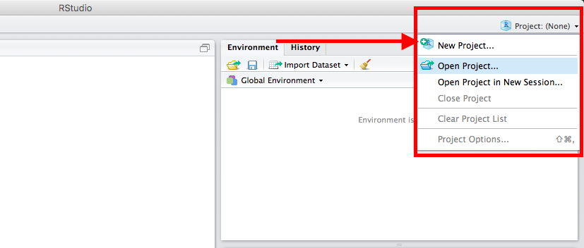

2.  Click `New directory` and `R package` as project type

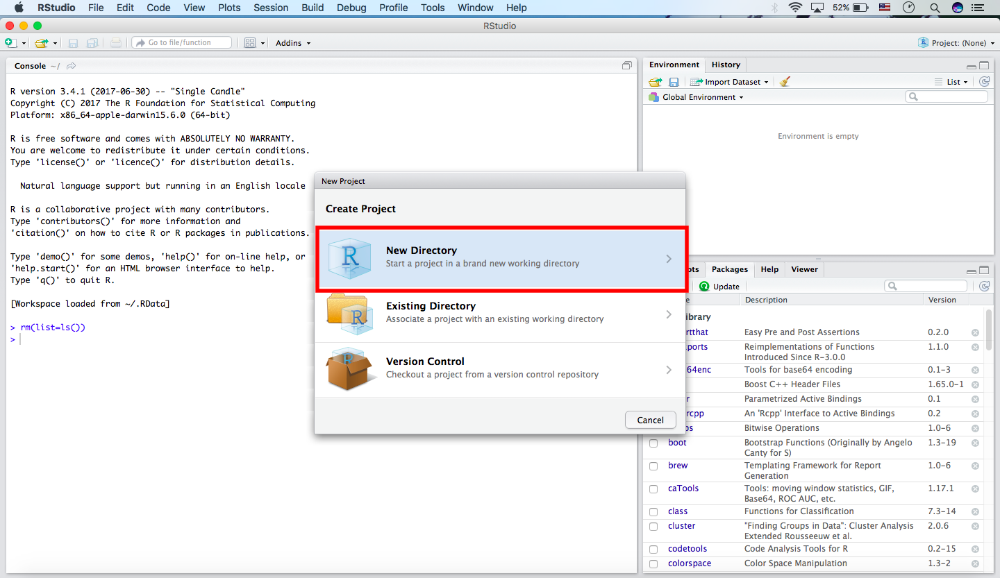

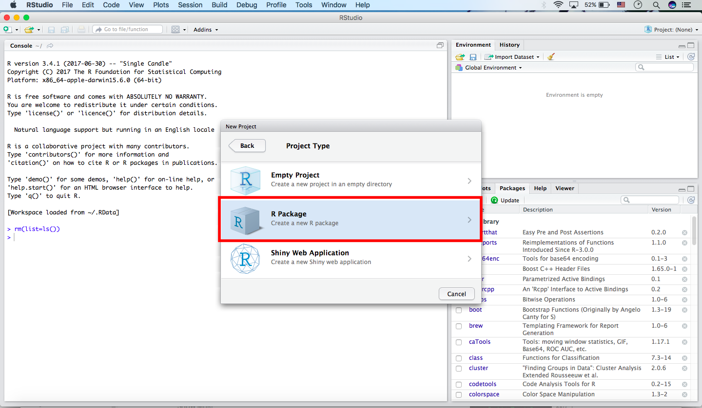

1.  Type `Package name` you want and click `Create Project`

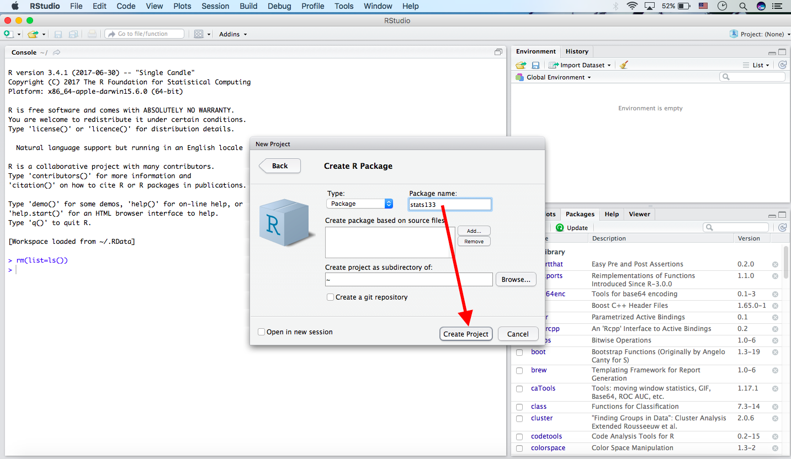

1.  You can see 'Hello, world!' code as an example and open `DESCRIPTION`file in Files. (You can close hello.R if you want to do) 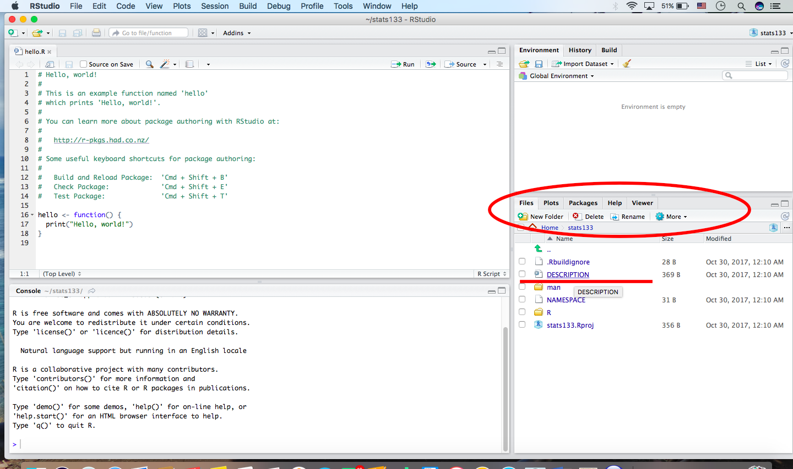

2.  On `DESCRIPTION` file, you can add more datails about Title, Author and Description. Don't forget **saving it**. 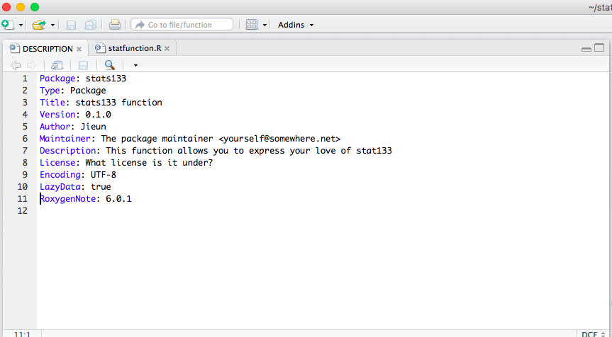

3.  Open new `R script` and write R code function you want to create. Here is my example of creating a funtion called `stats133_function`

``` r
# my example code

stats133_function <- function(love=TRUE) {
  if(love==TRUE){
     print("I love stat133!")
  }else{
     print("Sorry, I don't like R.")
  }
}
```

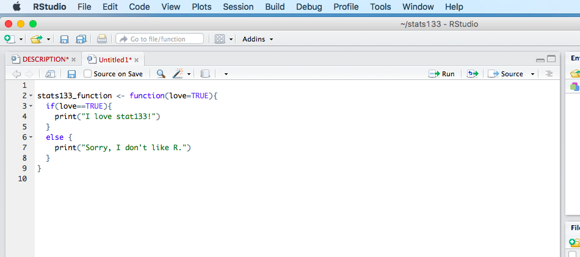

1.  Above R code, you should add `documantation` and make sure **what @param is in your function**. And **save ALL!**

``` r
# my example code

#' stats133 Function
#'
#' This function allows you to express your love of stat133 and R
#' @param love Do you love stat133 and R? Defaults to TRUE.
#' @keywords stats133
#' @export
#' @examples
#' stats133_function(love=TRUE)
#' @return If love=True, print "I love stat133!". If not, print "Sorry, I don't like R."
```

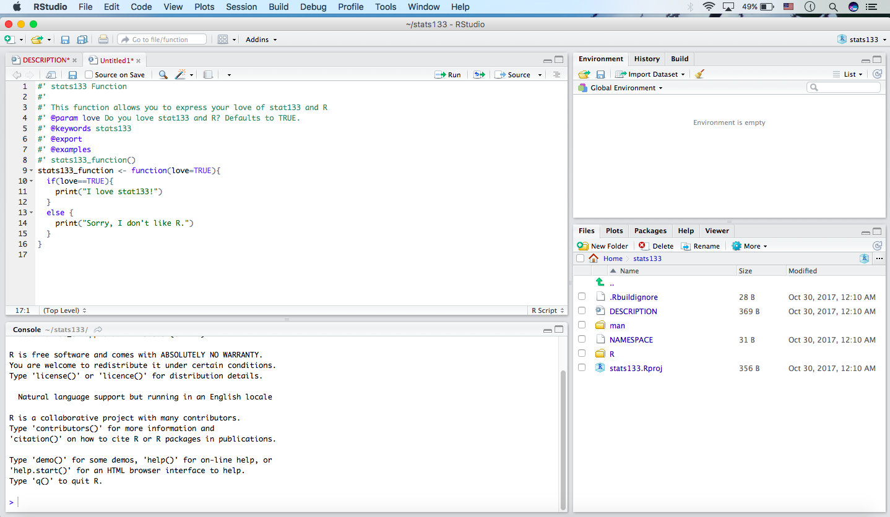

1.  Click `Build`(right next to History button) and `More`(blue gear icon). then select `Configure Build Tools`. 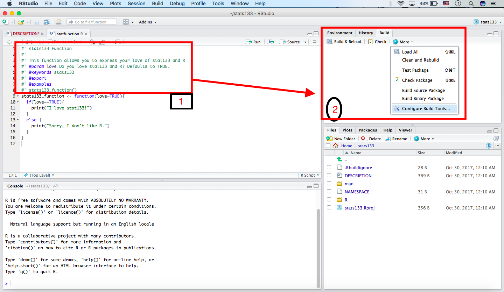

2.  As you can see Project Options pop-up, click `Build Tools`(on the left side of pop-up) and do `checkmark` for Generate documentation with Roxygen. 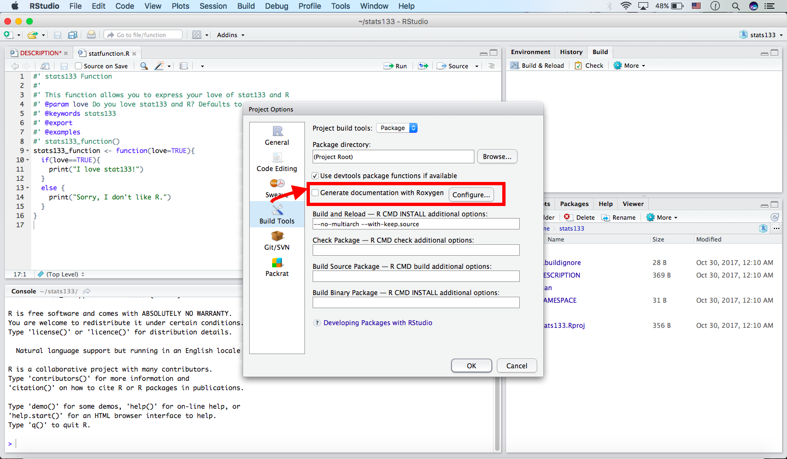

3.  Do `checkmark` ALL on Roxygen Options and click OK. After exiting pop-up, click `Build & Reload`. 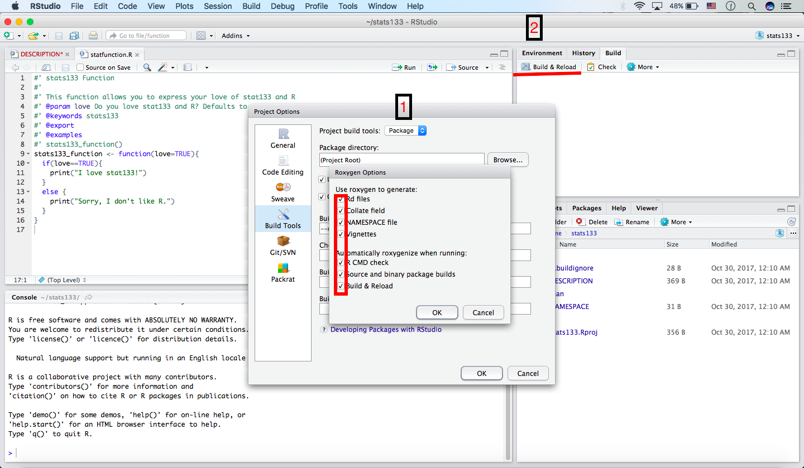

4.  Click `man` directory in Files to make sure there is Rd.file of your pacakge.

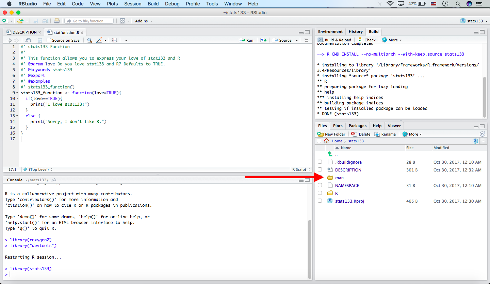 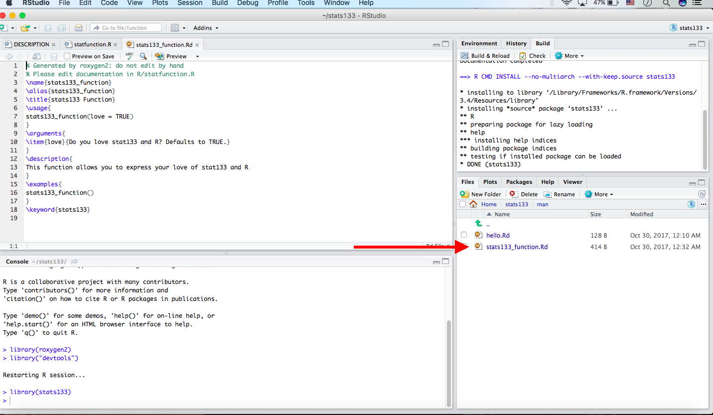

1.  Search your package by typing `your package name` and enjoy reading nice R Documntation of your package. 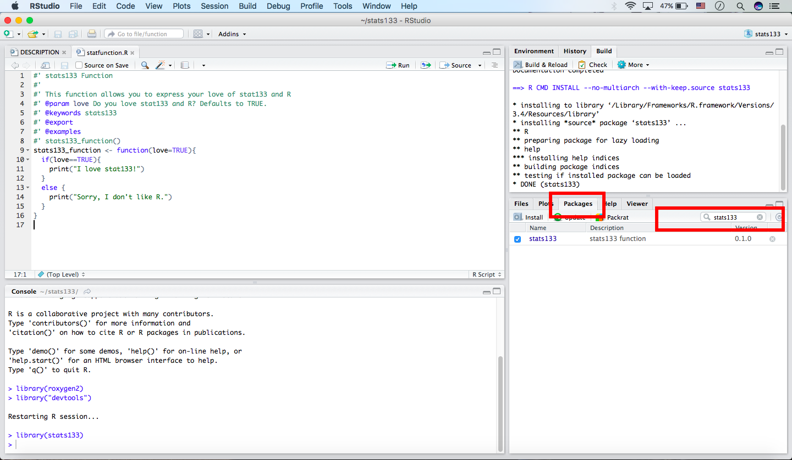 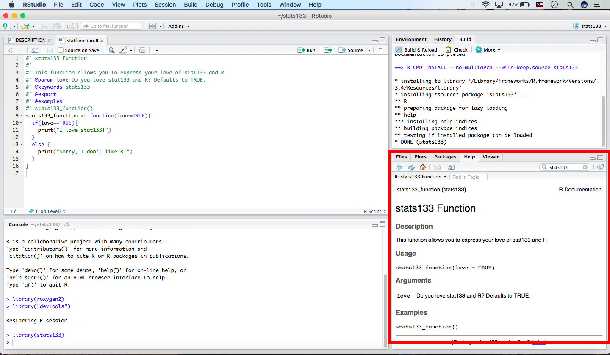

2.  Testing your own package if it is working! DONE!

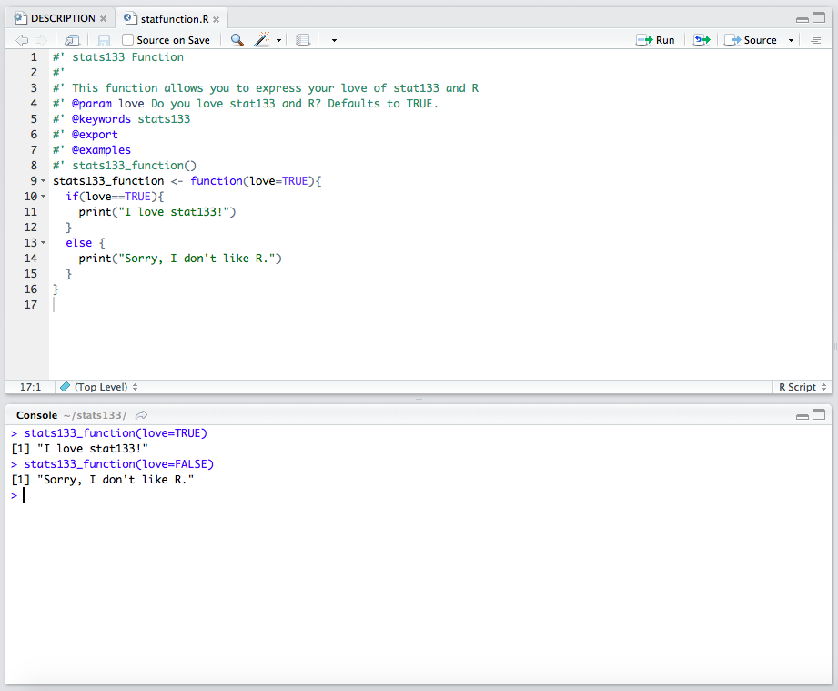

*If you want to follow these steps by watching video, there are some good videos for you!*

[video\_1](https://www.youtube.com/watch?v=9PyQlbAEujY)

[video\_2](https://www.youtube.com/watch?v=WK3_JAPP7ZM)

### Message for stat 133 peers

Even though our professor mentioned that he won't cover the material of how to creat R package in our class, creating your own R package can help you to understand how R package is made. Also, it is fun!. Whenever you play creating your R package, you should keep **3 main sources** in mind. `R code` `DESCRIPTION` `Documentation`

### References

[R-package](http://stat545.com/packages06_foofactors-package.html)

[writing-an-r-package](https://hilaryparker.com/2014/04/29/writing-an-r-package-from-scratch/)

[making-your-first-R-package](http://tinyheero.github.io/jekyll/update/2015/07/26/making-your-first-R-package.html)

[Rpackage\_instruction](http://web.mit.edu/insong/www/pdf/rpackage_instructions.pdf)

[R](http://r-pkgs.had.co.nz)

[devtools package](https://github.com/hadley/devtools)

[roxygen2 package](https://cran.r-project.org/web/packages/roxygen2/vignettes/roxygen2.html)

[video\_1](https://www.youtube.com/watch?v=9PyQlbAEujY)

[video\_2](https://www.youtube.com/watch?v=WK3_JAPP7ZM)
