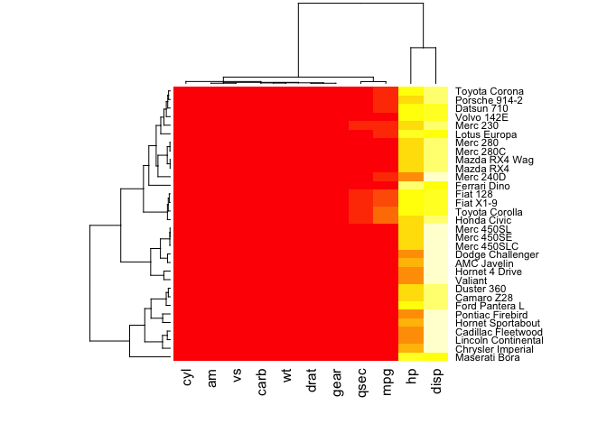
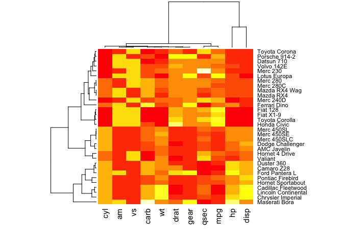
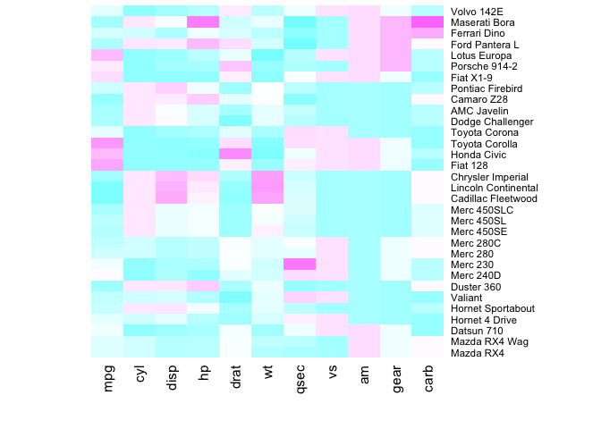
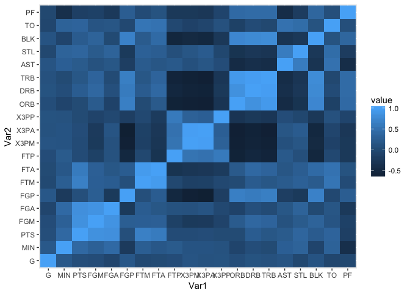
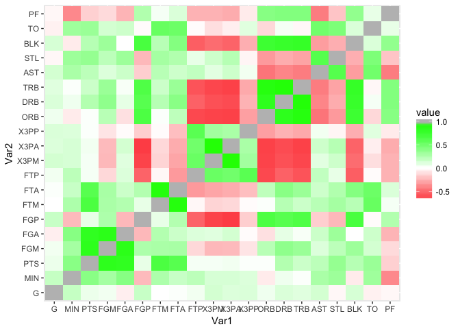
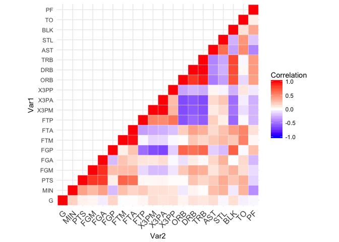

post02
================
JIEUN HWANG
11/26/2017

Make heatmaps in RStudio
========================

### Introduction

A heatmap is a table of data values which are represented as colors. It looks like a matrix with colored cells which correspond to the level of the measurement and is commonly used to display expression values in R. A heatmap is very useful graphic tool to understand data values stored in matrix in more accessible form. Also, it is helpful during finding/comparing missing value (NA) in time series or checking cross-correlation for large number of financial instruments in real world.

R provides serveal methods to make heatmap.

1.  `heatmap()`function
2.  using `ggplot2`

The native heatmap function is the simplest way of creating heatmaps. There is no requirement of installing any R package. Basically, you need to use function to make heatmaps.

Since we have learned ggplot2 in class, I would like to mention about how to make heatmap in ggplot2. Creating heatmap in ggplot2 needs to install package `ggplot2` and `reshape2` which I will explain more on post.

### 1. Heatmap function

Let's use the dataset called "mtcars" which R provides. Heatmap function is very straightforword to draw heatmaps. Before making heatmaps, you need to have `a numeric matrix` to use heatmap function and to input data. Let's make basic heatmap without any argument.

``` r
# change dataset as matrix
mtcars <- as.matrix(mtcars)

# defalut heatmap
heatmap(mtcars)
```



When you use heatmap function, heatmap shows both dendrograms alongside a colour-scaled representation of the data matrix itself. This default heatmap is not very helpful to understand the dataset because hp and disp variable have high values so that other variables with small values all look the same. Therefore, it is important to normalize the matrix. You need to use the scale argument which can be applied to row or to column.

``` r
# use the scale argument to normalize 
heatmap(mtcars, scale="column")
```



As you can see, this heatmap is more informatvie than defalut one.

Let's consider reordering. Check the order of both rows and columns on heatmap above compared to native "mtcar" matrix. They are different because heatmap does a reordering using clusterisation which calculates the distance between each pair of rows and columns and tries to order them by similarity. You can draw heatmap with the raw matrix not reordering as follow.

``` r
# no dendrogram nor reordering for neither column or row
heatmap(mtcars, Colv = NA, Rowv = NA, scale="column",col = cm.colors(256))
```



You can get rid of the dendrogram using Rowv and Colv arguments. Also, you can customize the color palette.

If you want to know about more arguments of heatmap function, here is a link of how to use [heatmap function](https://www.rdocumentation.org/packages/stats/versions/3.2.1/topics/heatmap)

### 2. Draw a heatmap in ggplot2

You can also play with creating a heatmap in ggplot2. ggplot2 provides a lot of graphic tools to make diverse heatmaps. Let's load different data which contains NBA basketball statistics and library(ggplot2)

``` r
nba <- read.csv("http://datasets.flowingdata.com/ppg2008.csv")
library(ggplot2)
```

As you know that you need a numeric matrix to create heatmap, you should get rid of 'Name' column as follow. (because name is not numeric). Name column is located on the first column of nba data.

``` r
# check the number of columns
ncol(nba)
```

    ## [1] 21

``` r
# create new data frame without the first column(Name)
dat <- nba[,2:21]

# make a numeric matrix 
dat <- as.matrix(dat) 
```

This time, you will create correlation matrix heatmap. I assume that you already know calculating correlation and basic ggplot2 in R because we have been practicing them a lot in stat133 class.

``` r
# create correlation matrix with 2 decimal points
cormat <- round(cor(dat), 2)
```

R provides a variety of methods for reshaping data prior to analysis. `melt` function helps to reshape data so that each row is a unique id-variable combination. Also, it helps to make wide-format data and to melts it into long-format data. To use melt function, you need to install package `reshape2` and load it.

``` r
#install.packages("reshape2")
library(reshape2)

# use melt function 
melted_cormat <- melt(cormat)
head(melted_cormat)
```

    ##   Var1 Var2 value
    ## 1    G    G  1.00
    ## 2  MIN    G  0.19
    ## 3  PTS    G  0.06
    ## 4  FGM    G  0.04
    ## 5  FGA    G -0.06
    ## 6  FGP    G  0.18

You use `geom_tile` function which helps to make tile plane with rectangles and to create heatmaps in R using ggplot2.

Check arguments for [geom\_tile](https://www.rdocumentation.org/packages/ggplot2/versions/1.0.1/topics/geom_tile)

``` r
# heatmap with defalut color 
p <- ggplot(data = melted_cormat, aes(x=Var1, y=Var2, fill=value)) + 
  geom_tile()

p
```



As above heatmap is hard to see the details in the tiles, you can control the colors by using `colorRampPalette()` function and `scale_fill_gradient2`. `rbg` function creates colors corresponding to the given intensities(between 0 and max) of red, green and blue primaries.

Check the description of each function and examples below

[colorRampPalette](https://www.rdocumentation.org/packages/dichromat/versions/1.1/topics/colorRampPalette)

[scale\_fill\_gradient2](https://www.rdocumentation.org/packages/ggplot2/versions/1.0.0/topics/scale_colour_gradient)

[rgb Color Specification](https://stat.ethz.ch/R-manual/R-devel/library/grDevices/html/rgb.html)

``` r
#set up a coloring scheme using colorRampPalette

red=rgb(1,0,0); green=rgb(0,1,0); blue=rgb(0,0,1); white=rgb(1,1,1)
RtoWrange <- colorRampPalette(c(red, white ) )
WtoGrange <- colorRampPalette(c(white, green) ) 

# gray out the 1 along the diagonal.
p <- p + scale_fill_gradient2(low=RtoWrange(100), mid=WtoGrange(100), high="gray")

p
```



Let's make heatmap with upper triangle of correlation matrix. First, you need to convert correlation matrix into upper triangle of correlation matrix. You create the function called get\_upper\_tri to make upper triangle easily. Inside get\_upper\_tri function, call the function `Lower.tri()` to convert original value into missing value below the diagonal of matrix.

``` r
# get upper triangle of the correlation matrix
  get_upper_tri <- function(cormat){
    cormat[lower.tri(cormat)]<- NA
    return(cormat)
  }
  
  
upper_tri <- get_upper_tri(cormat)
head(upper_tri)  
```

    ##      G  MIN  PTS  FGM   FGA   FGP   FTM  FTA   FTP  X3PM  X3PA  X3PP   ORB
    ## G    1 0.19 0.06 0.04 -0.06  0.18 -0.01 0.01  0.04  0.14  0.11  0.12  0.05
    ## MIN NA 1.00 0.40 0.30  0.41 -0.22  0.27 0.18  0.22  0.13  0.13  0.11 -0.07
    ## PTS NA   NA 1.00 0.85  0.83  0.07  0.67 0.61  0.03  0.03  0.04  0.01  0.01
    ## FGM NA   NA   NA 1.00  0.87  0.27  0.28 0.29 -0.13 -0.23 -0.22 -0.09  0.23
    ## FGA NA   NA   NA   NA  1.00 -0.23  0.25 0.17  0.11  0.10  0.14 -0.02 -0.10
    ## FGP NA   NA   NA   NA    NA  1.00  0.07 0.25 -0.52 -0.64 -0.67 -0.16  0.66
    ##      DRB  TRB   AST   STL   BLK    TO    PF
    ## G   0.12 0.10  0.14 -0.03  0.13 -0.05 -0.03
    ## MIN 0.05 0.01  0.28  0.33 -0.07  0.32 -0.39
    ## PTS 0.25 0.17  0.22  0.36  0.24  0.34 -0.15
    ## FGM 0.38 0.34  0.11  0.22  0.33  0.14 -0.12
    ## FGA 0.08 0.02  0.17  0.33  0.00  0.16 -0.24
    ## FGP 0.61 0.65 -0.16 -0.23  0.68 -0.02  0.26

Next, to reshape the data, again! you can use `melt` function. This time, you will pass the option `na.rm = TRUE` to remove NA values.

``` r
# Melt the correlation matrix
melted_cormat <- melt(upper_tri, na.rm = TRUE)
head(melted_cormat) 
```

    ##    Var1 Var2 value
    ## 1     G    G  1.00
    ## 21    G  MIN  0.19
    ## 22  MIN  MIN  1.00
    ## 41    G  PTS  0.06
    ## 42  MIN  PTS  0.40
    ## 43  PTS  PTS  1.00

Now, you are ready to make heatmap with upper triangle correlation matrix using ggplot2.

``` r
# create Heatmap using ggplot2

ggplot(data = melted_cormat, aes(Var2, Var1, fill = value))+
 geom_tile(color = "white")+
 scale_fill_gradient2(low = "blue", high = "red", mid = "white", 
   midpoint = 0, limit = c(-1,1), space = "Lab", 
   name="Correlation") +
 theme_minimal()+ 
 theme(axis.text.x = element_text(angle = 45, vjust = 1, 
    size = 12, hjust = 1))+
 coord_fixed()
```



-   This time, `scale_fill_gradient2` function is used with the argument limit = c(-1,1) as correlation coefficients range from -1 to 1. I specify negative correlations are in blue color and positive correlations in red. The argument 'space' is colour space in which to calculate gradient. "Lab" usually best unless gradient goes through white. The argument 'name' is the title of key.

-   `theme_minimal` function helps to build a minimalistic theme with no background annotations.

    In ggplot2, formatting of non-data elements is performed with the `theme` function.

-   `theme` function helps to format our plot and axis title

-   `element_text` function specifies the text-display of how non-data components of plot are a drawn. Check arguments for [element\_text](https://www.rdocumentation.org/packages/ggplot2/versions/2.1.0/topics/element_text)

-   `coord_fixed` function ensures that one unit on the x-axis is the same length as one unit on the y-axis.

### Message for stat 133 peers

We've learned data visualization such as histogram, plot, boxplot and scatterplot in R. But we don't talk about heatmap a lot in a class. As you can see, it is not complex to make heatmaps. Simply, you can use `heatmap` function. Or you can do in `ggplot2` and use function `geom_tile`. How about adding heatmap in shiny app to more visualize and analyze data?

### References

[NBA dataset](http://datasets.flowingdata.com/ppg2008.csv)

[heatmap function](https://www.rdocumentation.org/packages/stats/versions/3.2.1/topics/heatmap)

[making heatmap with function](https://www.r-graph-gallery.com/215-the-heatmap-function/)

[colorRampPalette](https://www.rdocumentation.org/packages/dichromat/versions/1.1/topics/colorRampPalette)

[scale\_fill\_gradient2](https://www.rdocumentation.org/packages/ggplot2/versions/1.0.0/topics/scale_colour_gradient)

[rgb Color Specification](https://stat.ethz.ch/R-manual/R-devel/library/grDevices/html/rgb.html)

[making heatmap easily](https://flowingdata.com/2010/01/21/how-to-make-a-heatmap-a-quick-and-easy-solution/)

[heatmap with ggplot2\_1](https://www.r-bloggers.com/r-defining-your-own-color-schemes-for-heatmaps/)

[heatmap with ggplot2\_2](http://www.sthda.com/english/wiki/ggplot2-quick-correlation-matrix-heatmap-r-software-and-data-visualization)

[geom\_tile](https://www.rdocumentation.org/packages/ggplot2/versions/1.0.1/topics/geom_tile)

[theme\_minimal](http://ggplot2.tidyverse.org/reference/ggtheme.html)

[element\_text](https://www.rdocumentation.org/packages/ggplot2/versions/2.1.0/topics/element_text)

[axis.text.x](http://sharpsightlabs.com/blog/format-titles-and-axes-in-ggplot2/)
